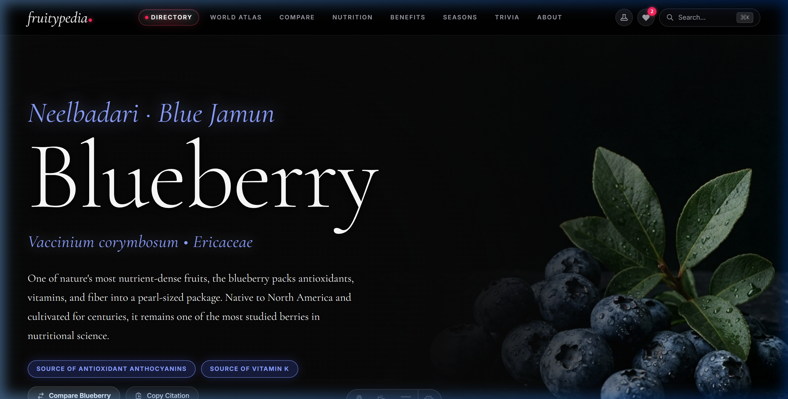
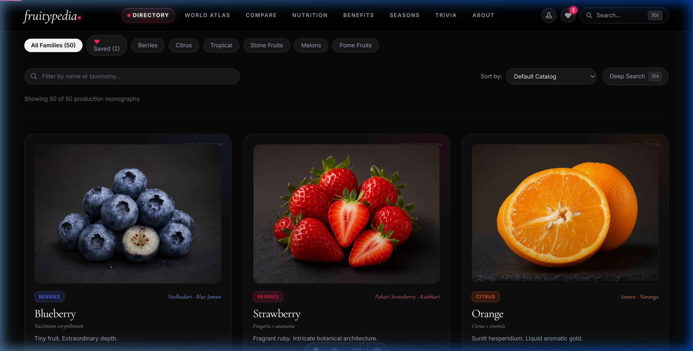
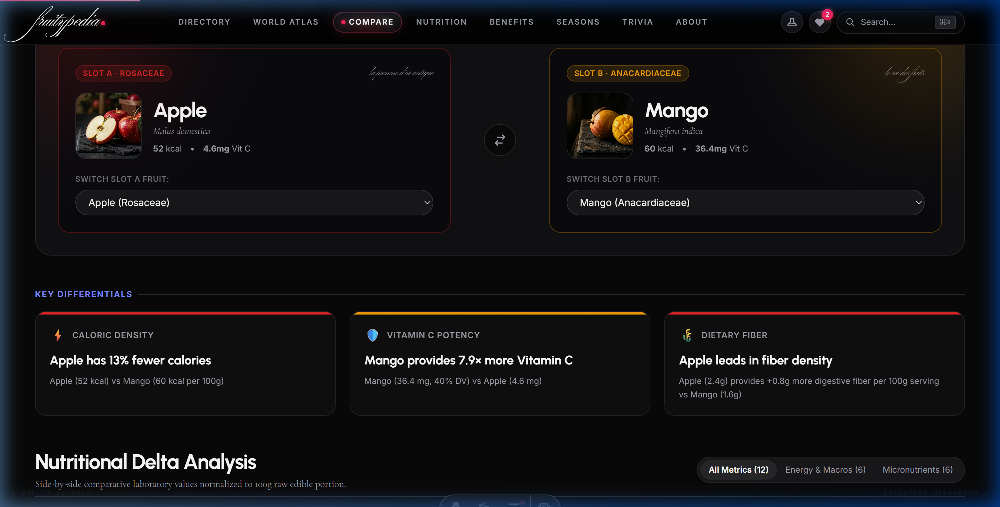
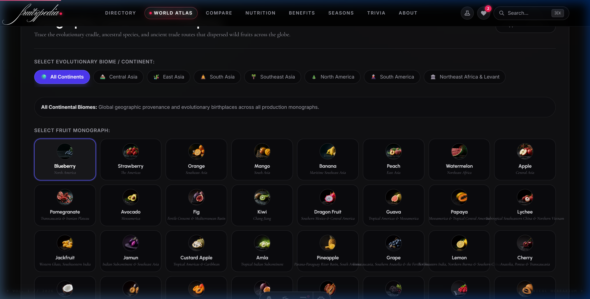
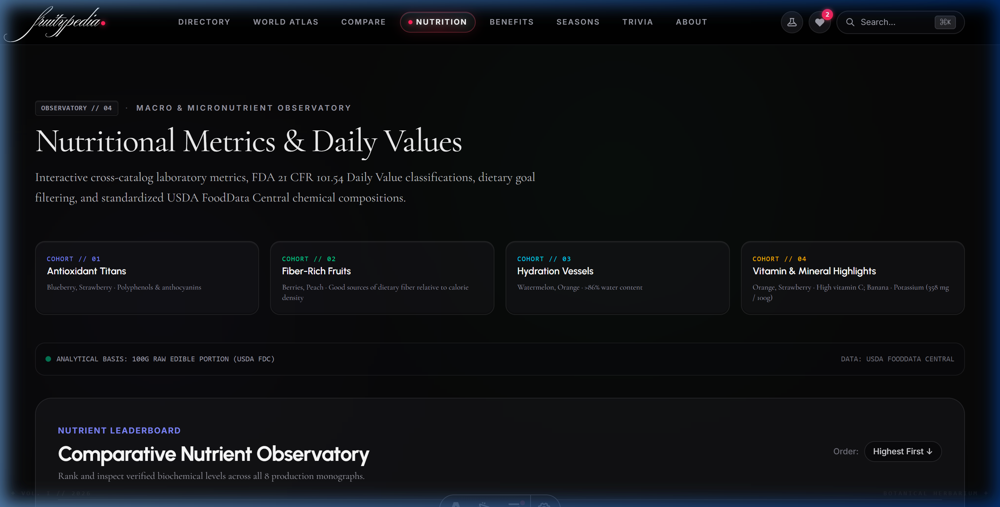
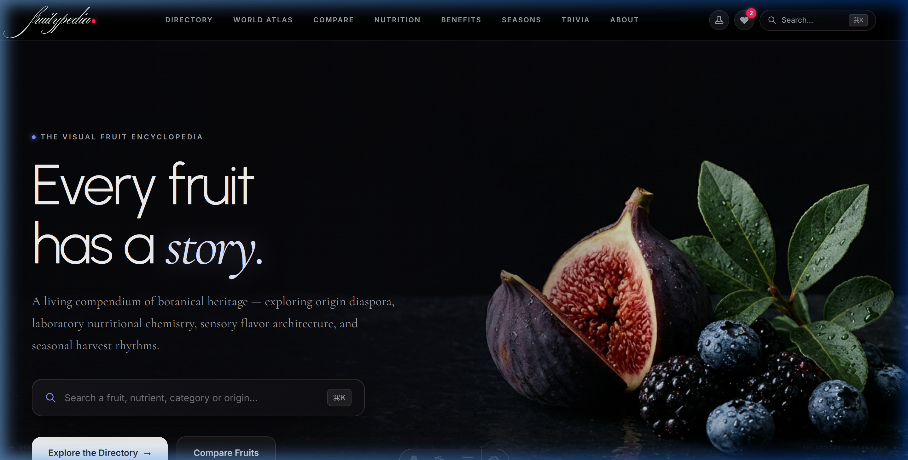

# 🍓 Fruitypedia — The Visual Fruit Encyclopedia

[](https://astro.build)
[](https://react.dev)
[](https://www.typescriptlang.org)
[](https://tailwindcss.com)
[](https://vitest.dev)
[](https://fdc.nal.usda.gov)
[](#-curated-botanical-index-50-monographs)
[](#-strict-3-font-typography-system)

**Fruitypedia** is an editorial-grade, scientifically certified digital encyclopedia of fruit. Built as a high-performance web platform, it bridges laboratory nutritional biochemistry, taxonomic botany, global agricultural phenology, and ancient trade history into an interactive reference experience.

Every monograph is calibrated directly from peer-reviewed scientific literature, the **USDA FoodData Central SR Legacy** dataset, and botanical records from **Royal Botanic Gardens, Kew** — with zero placeholder records, zero generic copy, and zero unverified claims.

---

## 📸 Visual Showcase & Architecture Gallery

### 1. Botanical Monograph Hero & Scientific Telemetry
> Full-bleed editorial presentation with certified USDA badges, authentic Indian botanical heritage nicknames (*e.g., Neelbadari · Blue Jamun*), interactive serving size scaler, and quick actions ("Compare Fruit" & 1-click citation copy).



---

### 2. Curated 50-Fruit Botanical Directory
> Scalable interactive catalog with category pill filtering, instant search across botanical taxa and Indian nicknames, multi-metric sorting, and tactile card ambient theme glow.



---

### 3. Side-by-Side Analytical Comparison Laboratory
> Direct dual-specimen analytical comparison comparing USDA nutritional telemetry, sugar-to-fiber ratios, antioxidant differentials, and sensory flavor architecture.



---

### 4. Interactive Botanical World Atlas
> SVG TopoJSON cartographic engine visualizing native evolutionary cradles, speciation biomes, and ancient continental diaspora corridors (*Tian Shan Silk Road*, *Indo-Malayan Archipelago*, *Fertile Crescent*).



---

### 5. Macro & Micronutrient Laboratory Observatory
> Interactive cross-catalog matrix with FDA 21 CFR 101.54 Daily Value classifications, nutritional leaderboards, and goal-based dietary targeters.



---

### 6. Fine-Art Editorial Landing Experience
> Cinematic dark-mode visual prologue featuring curated prompt pills, golden master specimen spotlights, and smooth kinetic micro-interactions.



---

## 🎨 Strict 3-Font Typography System

Fruitypedia operates under a strict, mathematically proportioned **3-font typography system** designed to eliminate visual clutter and establish museum-grade editorial hierarchy:

| Font Family | Role | Purpose & Usage |
| :--- | :--- | :--- |
| **Urbanist** | Display & Telemetry Sans | Numerical values, serving sizes, macronutrient meters, category chips, and section folios. |
| **Cormorant Garamond** | Editorial Serif (Roman & Italic) | Main monograph titles, binomial Latin nomenclature (*Genus species*), authentic Indian heritage nicknames, pull quotes, and editorial prose. |
| **Inter** | System UI & Technical Sans | Dense data matrices, USDA reference tables, navigation microcopy, button labels, and search inputs. |

*Note: All script and calligraphy fonts (*Ballet*) have been entirely eradicated in favor of elegant, accessible `Cormorant Garamond Italic`.*

---

## 🌟 Core Scientific & Exploration Modules

### 🍇 1. Individual Botanical Monographs (`/fruit/[slug]`)
* **Certified USDA Deck**: 25+ normalized nutrients per 100g raw edible portion with dynamic serving size calculations (100g, 1 cup, whole fruit).
* **Authentic Indian Heritage Names**: Indigenous botanical nomenclature (*Aam · Phalon Ka Raja*, *Kashmiri Seb · Deva-phala*, *Amritavriksha · Dhatri*, *Sitaphal · Sharifa*, *Kathal · Panasa*).
* **Sensory Architecture**: Calibrated 10-point sweetness, acidity, and bitterness meters with sommelier tasting notes.
* **Evidence-Tiered Wellness**: Scientific consensus tiers (`Established`, `Emerging`) with exact biochemical biomarkers (*Anthocyanins*, *Ellagitannins*, *Hesperidin*).
* **One-Click Academic Citation**: Instant formatted academic citations copied to clipboard with visual verification toasts.
* **Discovery Bridges**: Contextual similar-fruit cohorts and links to side-by-side comparison.

### 🔬 2. Side-by-Side Analytical Laboratory (`/compare`)
* **Dual-Slot Specimen Calibration**: Compare any two fruits across all 50 monographs with instant URL synchronization (`?a=apple&b=mango`).
* **Visual Differentials**: Real-time advantage calculations, proportional dual bars, and sensory radar chart overlays.
* **Cohort Presets**: Quick-start matchups (*Berry Duel*, *Citrus vs Tropical*, *Orchard Classics*).

### 📊 3. Macro & Micronutrient Observatory (`/nutrition`)
* **Cross-Catalog Matrix**: Complete interactive data table comparing all 50 specimens simultaneously.
* **FDA Daily Value Benchmarks**: Automated classification compliant with **FDA 21 CFR 101.54** (`High Source ≥20% DV`, `Good Source 10–19% DV`, `Low ≤5% DV`).
* **Dietary Targeter**: Presets for *Immunity & Vitamin C*, *High Fiber*, *Low Caloric Density*, *Hydration Vessels*, and *Low Sugar*.

### 🩺 4. Health Benefits Directory (`/benefits`)
* **7 Biological System Cohorts**: Cardiovascular, Immune Defense, Gut Microbiome & Digestion, Metabolic Balance, Cellular Hydration, and Connective Tissue.
* **Strict Anti-Hype Standard**: Full compliance with **FDA 21 CFR 101.14** educational criteria — strictly grounded in peer-reviewed clinical research without pseudoscientific "superfood" exaggerations.

### 🗓️ 5. Harvest Seasons & Phenology Calendar (`/seasons`)
* **Astronomical Solstice & Equinox Cycles**: Phenological indicators spanning dormancy break, photon flux accumulation, peak harvest, and chilling requirements.
* **Hemispheric Inversion**: Seamless toggle between Northern and Southern (+6 months) agricultural windows.
* **Real-Time Month Detection**: Live indicator highlighting fruits currently at their agricultural peak.

### 🌍 6. Botanical World Atlas (`/explore`)
* **Cartographic Biomes**: Filter native origins by continental cradle (*Tian Shan Silk Road*, *Yangtze River Valley*, *Indo-Malayan Archipelago*, *Mesoamerican Neotropics*, *Fertile Crescent*).
* **Ancestral Progenitors**: Archaeological domestication timelines and wild ancestors (*Malus sieversii*, *Musa acuminata*, *Fragaria chiloensis*).

### ⚡ 7. Command Palette Quick Search (`⌘K` / `Ctrl+K`)
* **Fuzzy Telemetry Search**: Instant client-side search powered by Fuse.js indexing common English names, Latin binomials, Indian nicknames, botanical families, and nutrients.

---

## 🌿 Curated Botanical Index (50 Monographs)

Fruitypedia houses 50 fully verified production monographs categorized across 6 primary botanical cohorts:

```
├── Berries (Vaccinium, Fragaria, Rubus, Vitis)
│   ├── Blueberry, Strawberry, Blackberry, Raspberry, Grape, Jamun, Amla, Cranberry...
├── Citrus (Rutaceae)
│   ├── Orange, Lemon, Lime, Grapefruit, Mandarin, Pomelo...
├── Tropical & Subtropical (Anacardiaceae, Musaceae, Moraceae...)
│   ├── Mango, Banana, Pineapple, Papaya, Guava, Jackfruit, Passionfruit, Dragonfruit, Lychee, Durian, Mangosteen, Custard Apple, Sapodilla, Bael...
├── Stone Fruits / Drupes (Prunus)
│   ├── Peach, Cherry, Plum, Apricot, Nectarine, Date, Coconut, Ber...
├── Melons / Pepo (Cucurbitaceae)
│   ├── Watermelon, Cantaloupe, Honeydew, Galia, Winter Melon...
└── Pome Fruits (Rosaceae)
    ├── Apple, Pear, Asian Pear, Quince, Loquat...
```

---

## 🛠️ Technology Stack

| Layer | Technology | Details |
| :--- | :--- | :--- |
| **Framework** | [Astro 5](https://astro.build) | Island architecture with static route generation (SSG) |
| **Interactive Islands** | [React 19](https://react.dev) | Hydrated client islands (`client:load`, `client:idle`) |
| **Language** | [TypeScript 5](https://www.typescriptlang.org) | Strict type safety across all data structures and props |
| **Styling** | [Tailwind CSS](https://tailwindcss.com) | Modern CSS tokens and custom utility classes |
| **Motion Engine** | [GSAP](https://gsap.com) + [ScrollTrigger](https://gsap.com/scrolltrigger) | Staggered entrance animations tied to View Transitions |
| **Cartography** | [React Simple Maps](https://www.react-simple-maps.io) | TopoJSON 110m world boundaries with custom projection |
| **Data Validation** | [Zod](https://zod.dev) | Strict runtime schema enforcement for all monographs |
| **Testing** | [Vitest](https://vitest.dev) | 77 automated unit and integration tests (100% passing) |

---

## 🚀 Developer Quickstart

### Prerequisites
* Node.js `v18.17.0` or higher
* npm `v9.0.0` or higher

### Installation & Local Run

```bash
# 1. Clone the repository
git clone https://github.com/Abhishek12890551/Fruitypedia.git
cd Fruitypedia

# 2. Install dependencies
npm install

# 3. Start local development server
npm run dev
```
Open **[http://localhost:4321](http://localhost:4321)** in your browser.

### Automated Testing

```bash
# Run Vitest test suite (validates Zod schemas, USDA normalization, calculations)
npm test

# Run Astro build verification
npm run build
```

---

## 📚 Academic Provenance & Standards

* **Nutritional Telemetry**: Normalized per 100g raw edible portion from the [USDA FoodData Central SR Legacy](https://fdc.nal.usda.gov) and Foundation datasets.
* **Daily Value Benchmarks**: Formatted according to **FDA 21 CFR 101.9** and **21 CFR 101.54** specifications based on a 2,000-calorie reference intake.
* **Taxonomic Phylogeny**: Aligned with the **APG IV** (Angiosperm Phylogeny Group) standard and the **Royal Botanic Gardens, Kew** taxonomic index.

---

## 📄 License & Attribution

This project is licensed under the **MIT License** — see the [LICENSE](LICENSE) file for details.  
Botanical photography and data visualizations are cataloged under open scientific research principles.
